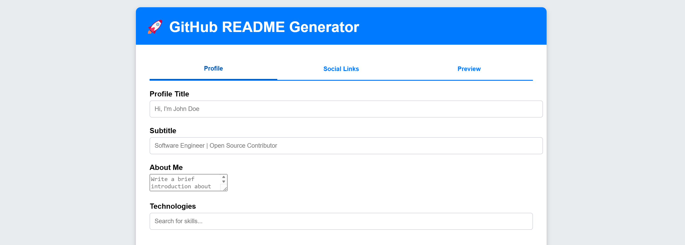
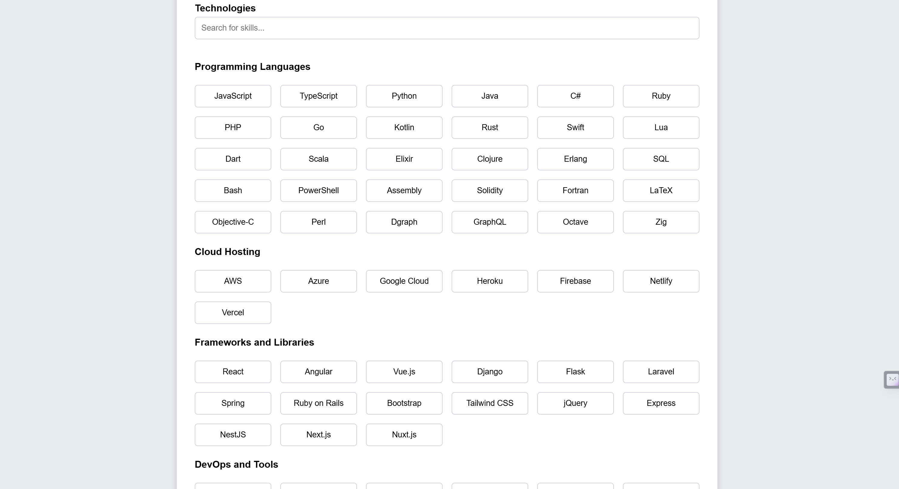
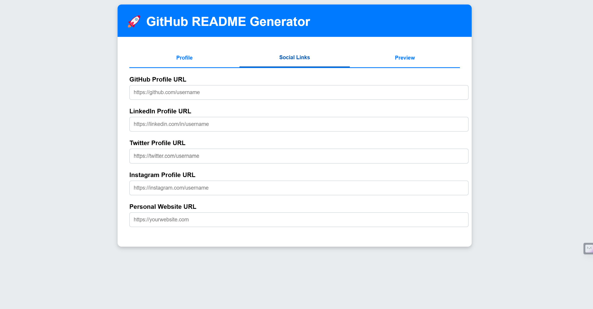
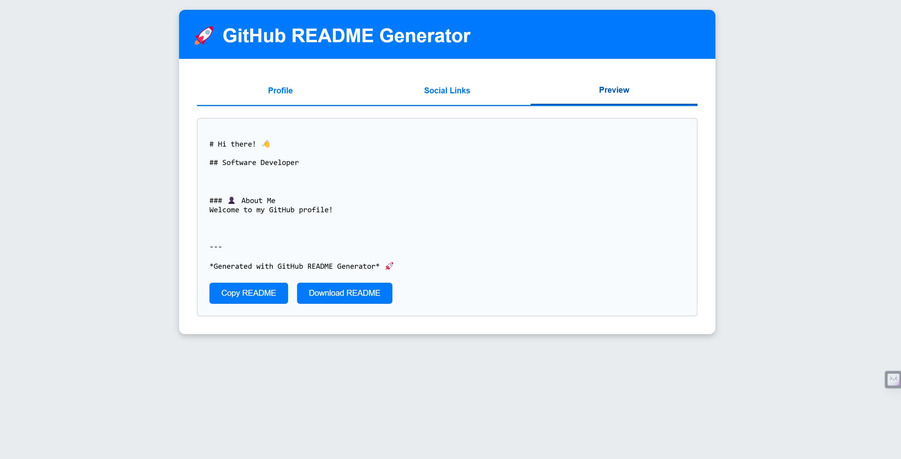

# GitHub README Generator 🚀

**GitHub README Generator** is a user-friendly, web-based tool to create professional and visually appealing README files for your GitHub repositories. It offers live previews, customization options, and easy-to-use features to generate Markdown content effortlessly.

---

## 🌟 Features

- **Interactive Tabs**: Navigate through different sections like Profile, Social Links, and Preview with a clean UI.
- **Skill Selector**: Choose your technologies from a wide range of options.
- **Social Badges**: Easily add GitHub, LinkedIn, Twitter, and other social media links.
- **Live Markdown Preview**: See real-time changes to your README content.
- **Download or Copy**: Save your README as a file or copy it directly to your clipboard.

---

## 🖥️ Preview

### **Homepage**


### **Technologies Selector**


### **Social Badges**


### **Preview Section**



---

## 🛠️ How It Works

1. **Fill Profile Details**: Add a title, subtitle, and a brief about yourself.
2. **Select Technologies**: Choose your skills or add custom ones.
3. **Add Social Links**: Enter URLs for GitHub, LinkedIn, Twitter, etc.
4. **Preview and Download**: View the generated Markdown in the live preview and download it.

---

## 🧩 Tech Stack

- **Frontend**: HTML, CSS, JavaScript
- **Styling**: CSS Grid, Transitions
- **Interactivity**: Vanilla JavaScript (DOM manipulation)

---

## 📁 Folder Structure
```
.
├── index.html    # Main HTML file
├── styles.css    # Styling for the interface
└── script.js     # Logic for interactivity and README generation

```

---

## 🎉 Getting Started
1. **Clone the Repository**:
```bash
  git clone https://github.com/your-username/github-readme-generator.git

```
2. **Open the index.html in your browser**:

   Simply open the index.html file in any modern web browser to start using the application.

---

## 🤝 Contributing
  Contributions are welcome!
  
  Feel free to fork the repository and submit a pull request.

---

## 📜 License
  This project is licensed under the MIT License.


